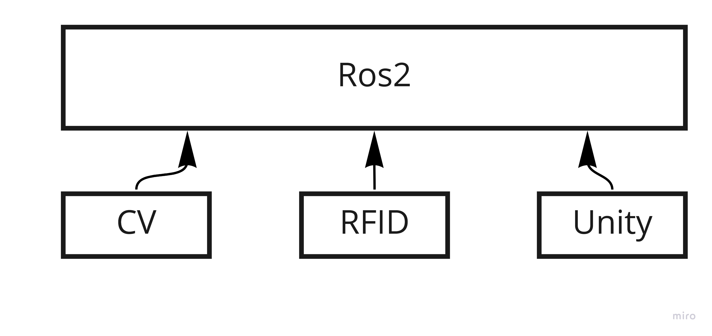

# Ros2 Rearchitecture

## Main Branch:

Main branch establish a desired architecture in the future, since we haven't included RFID and UI functions in the code. 

### Overall Structure

Main components:

1. CV (detecting players)
2. RFID (rectifying the coordinate)
3. Unity (game logic and displaying)

The general process is as follow:
1. The CV part is responsible for detecting each player and sending detected coordinate message. 
2. The RFID get the raw coordinate and process the date to match each coordinate with correct ID and then send this message to the system as well.
3. The unity uses raw coordinate for game logic and render the output to camera. If modifications has been made by RFID, those modifications will be adjusted in Unity as well. 

## IGYM_oldversion Branch:

This branch is used for testing detection code (migrate the old code). It doesn't include the FLIR camera.

## add_FLIR cam Branch:

This branch adds the FLIR camera and is used for real field test.

# Ros2 Highlights

We build a new message type and uses it as the conveying message in our ROS2 system. More info about the message type can be found in source code.

## Multithread
In each node, multithread is used so that processing data and sending data won't intervene each other. For now, manual lock is not used except for those implemented by Ros2 system.

## Unity
More information about how ros2 and unity is integrated can be found on the official [site](https://github.com/Unity-Technologies/Unity-Robotics-Hub). After testing the delays is about 15 ms(under ubuntu, windows systems have some different statistics probably due to different reasons such as unofficial supports or tasks priority):
1. about 50% delays are below 10ms.
2. about 90% delays are below 20ms.

## CV
1, Player_detection part only utilizes the core part of old code and delete the useless part due to the camera

2, In the .cmake file and player_detection node, I use the absolute path. I will change it to relative path in the future 
